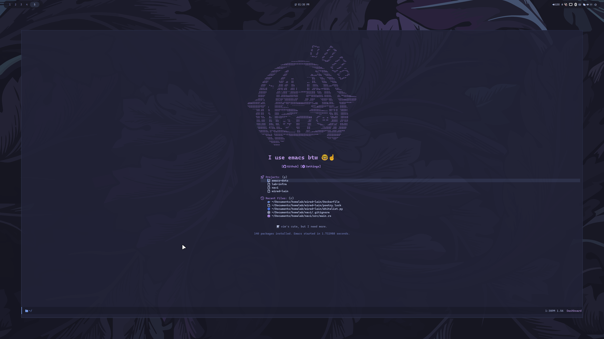

<div align="center">
    <h1>✨ My Emacs Setup</h1>
    <p style="text-align:center;">
      This repository contains my personal Emacs setup, including configurations for various packages and terminal utilities. It's designed to streamline my development environment and can serve as a base for others looking to customize their Emacs experience.
    </p>
    
</div>

## 🚀 Quick Start

Clone the repository and open Emacs:

```bash
git clone https://github.com/robert-nogueira/emacs-dots ~/.emacs.d
emacs
```

All custom settings will be loaded automatically.

## 🛠️ Requirements

Emacs 30.2+
Git

## 💡 Notes

Tailored for my personal workflow; feel free to adjust.
Fork, clone, and explore freely.
Contributions and improvements are welcome via pull requests.

## 🧰 Tools & Packages

<details>
<summary>Click to reveal</summary>

### Completion / Minibuffer

* **Company** → *Auto-completion*
* **Consult** → *Enhanced commands & navigation*
* **Marginalia** → *Annotations in completions*
* **Orderless** → *Flexible matching*
* **Vertico** → *Vertical completion UI*

### Core Essentials

* **Custom Keybindings** → *Personal shortcuts*
* **Package Management** → *Installed packages handling*
* **General Settings** → *Emacs general configurations*

### Hooks

* **Centaur Tabs** → *Tab bar integration*
* **Diff-hl** → *VCS highlighting*
* **Dockerfile** → *Dockerfile editing hooks*
* **Treemacs** → *File explorer hooks*
* **VTerm** → *Terminal integration*
* **LSP**

  * `lsp-mode` → *LSP support*
  * `lsp-pyright` → *Python LSP*
  * `lsp-ui` → *UI enhancements*
  * `terraform LSP` → *Terraform support*
* **Python**

  * `Python` → *Python dev*
  * `Poetry` → *Dependency management*

### Programming / Language Support

* **LSP support** → *Language server support*
* **Python** → *Python dev*
* **Rust** → *Rust dev*
* **Web Dev** → *HTML/CSS/JS*

### Tools

* **Centaur Tabs** → *Tab bar*
* **Discord Rich Presence** → *Discord integration*
* **Docker integration** → *Docker support*
* **Flycheck** → *Syntax checking*
* **Flycheck + VCS integration** → *Flycheck with version control*
* **Custom utility functions** → *Personal helper functions*
* **Ligatures** → *Font ligatures*
* **Projectile** → *Project management*
* **Terraform** → *Terraform support*
* **Treemacs** → *File explorer*
* **Version Control integration** → *Git/VCS tools*
* **VTerm** → *Terminal integration*

### UI / Look & Feel

* **Dashboard** → *Startup dashboard*
* **Faces / Fonts / Styles** → *Styling*
* **UI tweaks** → *Interface adjustments*
* **Modeline customization** → *Modeline tweaks*
* **Themes / Colors** → *Theme setup*
* **Banners** → *bocchi-smiling* → *emu* → *frieren* → *laptop-anime-girl* → *uwu*

### Misc / Optimization

* **Misc utilities** → *General utilities*
* **Performance tweaks** → *Optimizations*
* **Aliases** → *Command shortcuts*

</details>
